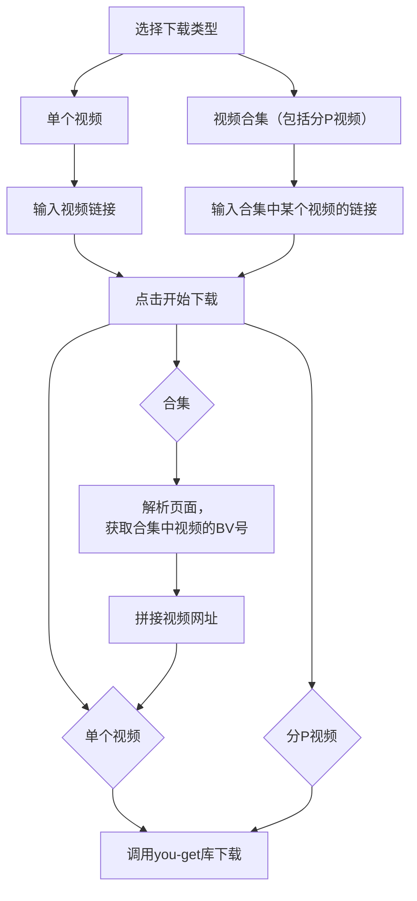

# 🧰 工具箱应用 - PyQt6多功能工具集

这个工具箱应用是一个基于PyQt6的图形界面程序，集成了多种实用工具，包括音乐下载、视频下载、文件重命名和视频转换等功能。所有工具都通过美观的卡片式界面呈现，提供一致的用户体验。

### ✨ 主要功能（后续还会更新）

- 🎵 **音乐下载器**：从网易云音乐下载歌曲
- 📹 **B站视频下载器**：支持单个视频和合集下载
- 🔄 **视频转换器**：将视频文件转换为MP3音频
- 📝 **批量重命名工具**：通过表格或前后缀批量重命名文件

### 🛠️前置要求
- Python 3.8+
- PyQt6
- FFmpeg (视频转换功能需要)
- you-get (视频下载功能需要)

### 🚀使用说明

#### 1. **音乐下载器**
- 实现原理：
通过从网易云下载文件

- 操作方式：
1. 在搜索框中输入歌曲名称
2. 从搜索结果中选择要下载的歌曲
3. 点击"下载选中歌曲"按钮

- 部分问题：
部分音乐无法下载（可能因为需要会员）

#### 2. **B站视频下载器**
- 实现原理（感兴趣的话可以帮我看看怎么优化一下代码）

#### 3. **批量文件重命名**
1. 选择文件夹
2. 选择命名模式（表格命名或后缀命名）
3. 执行重命名
- 你应该能看懂这个东西是怎么用的，虽然它不太完善

#### 4. **视频转音频**
- 应用场景：从B站下载完一些视频之后，我们可以直接将视频视频转成音频，可以和B站视频下载器等效成一个音乐下载器

- 使用方法：不多赘述，你应该能看懂我做的界面的

### 🔧 常见问题解决
- **问题：视频下载失败**
    解决方案：

        检查网络连接

        确保安装了最新版you-get

        验证B站链接是否有效

- **问题：音乐搜索无结果**
    解决方案：

        尝试不同的关键词

        检查网易云音乐API状态

        等待几分钟后重试（可能触发频率限制）

- **问题：视频转换失败**
    解决方案：

        确保安装了FFmpeg并配置了环境变量

        检查输入视频文件是否损坏

        尝试不同的输出目录（路径不要包含中文或特殊字符）
- 其他问题欢迎提出

